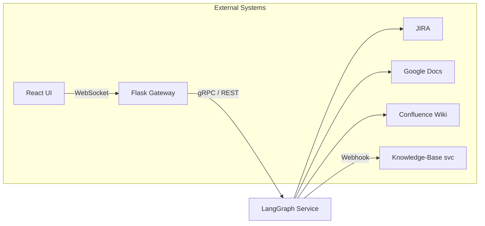
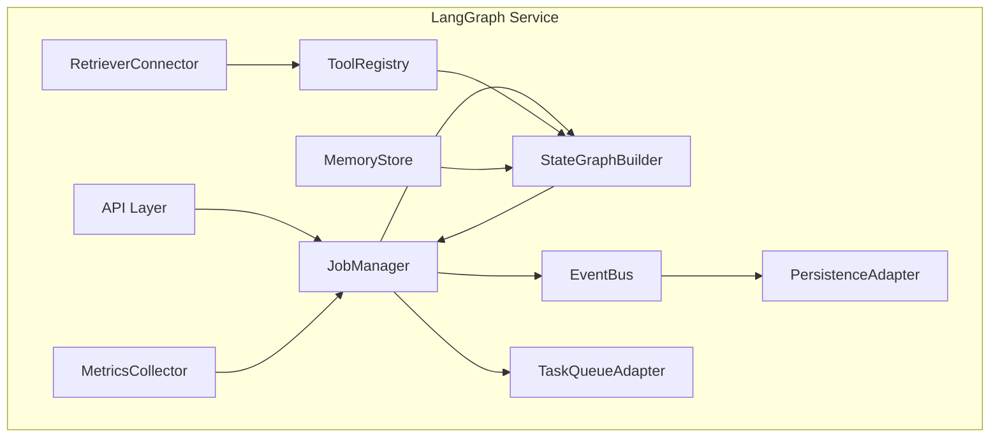
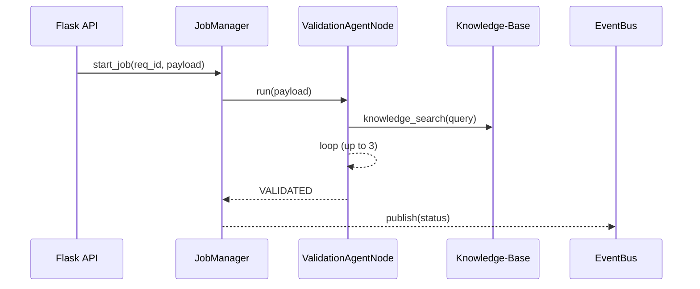
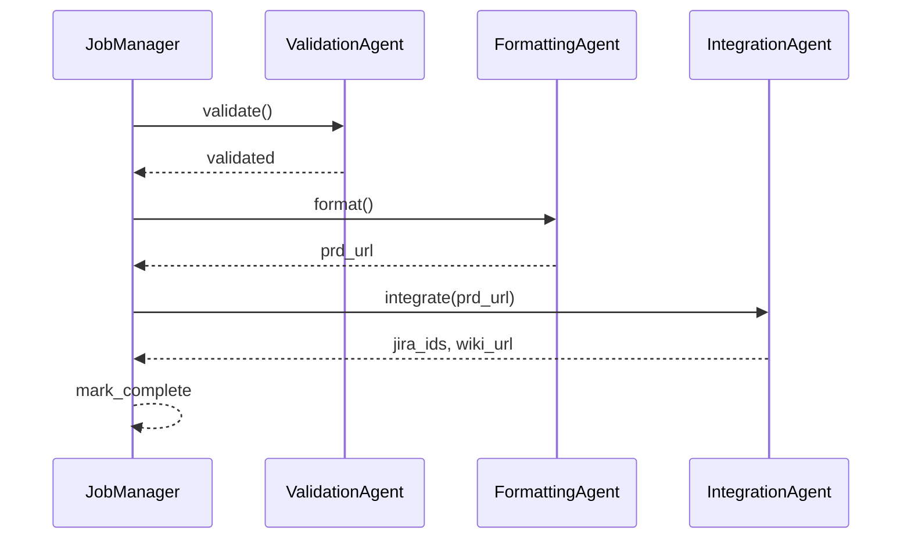
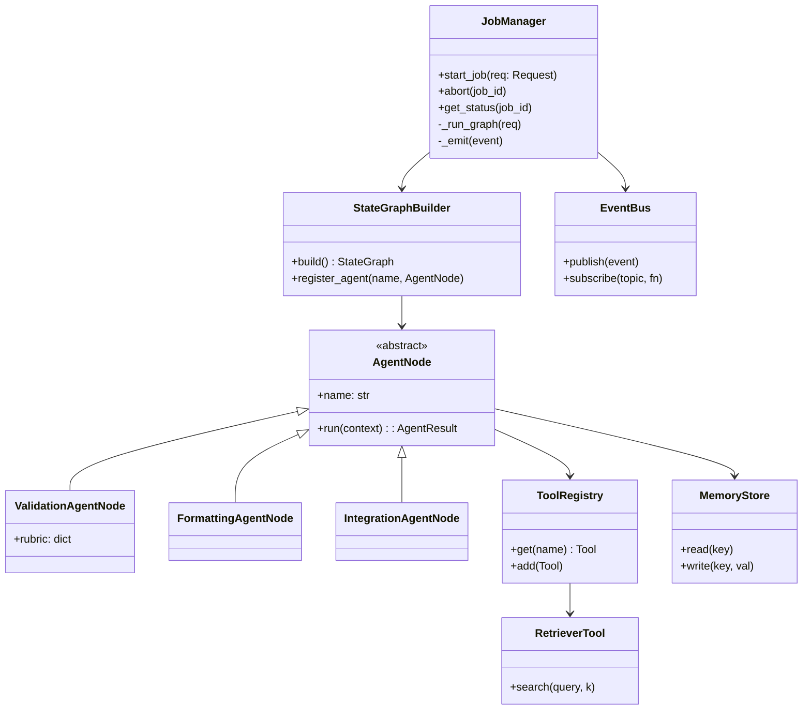

# LangGraph Service – Detailed Architecture Design Document
*Revision 1 – April 17 2025*

---

## 1  Purpose
The **LangGraph Service** orchestrates a directed state‑graph of autonomous LLM‑powered agents that validate, format, and integrate data‑engineering requests. It exposes an API for starting jobs, emits real‑time status events, and encapsulates all AI‑specific logic so the gateway, UI, and downstream systems remain technology‑agnostic.

---

## 2  Context & Scope

*Only the yellow node (**LangGraph Service**) is covered by this document.*

---

## 3  Quality Attributes
| Attribute | Rationale | Target |
|-----------|-----------|--------|
|**Modularity**|Agents, tools, and graph definitions change independently.|100 % unit test coverage per module|
|**Latency**|End‑to‑end < 3 s P95 for simple requests.|≤ 3000 ms|
|**Scalability**|Parallel job execution.|Up to 500 concurrent jobs|
|**Observability**|Cost, latency, error rates visible.|Prometheus metrics; OTLP traces|

---

## 4  Component Architecture

*Each box is deployed as a Python package; bold lines denote synchronous calls, dashed lines (not shown) denote async tasks.*

---

## 5  Runtime Behaviour
### 5.1  Validation Loop


### 5.2  Full Pipeline


---

## 6  Class Design (UML)


*Design Patterns*
- **Builder**: `StateGraphBuilder` constructs complex graphs.
- **Strategy**: Each `AgentNode` encapsulates its own `run` strategy.
- **Observer**: `EventBus` decouples state changes from consumers (gateway, dashboards).

---

## 7  Concurrency & Scaling
| Component | Threading Model | Horizontal Scaling |
|-----------|-----------------|--------------------|
|API Layer|FastAPI (async Uvicorn)|Kubernetes HPA (`cpu` + `RPS`)|
|JobManager|Celery worker per pod|Queue partition key = job_id|
|LLM calls|Async non‑blocking|Shared per‑pod httpx connection pool|

*Queue size metrics trigger auto‑scaling from 3 → 30 workers.*

---

## 8  Persistence & State
| Store | Purpose | Tech |
|-------|---------|------|
|Redis Streams|Job status events|MemoryBus fallback cache|
|PostgreSQL|Job audit log, costs|SQLAlchemy ORM|
|S3|Serialized graphs, agent responses|Versioned buckets|

---

## 9  Configuration
```toml
# langgraph.toml
[llm]
model = "gpt-4o-mini"
max_tokens = 4096

[validation]
max_cycles = 3
rubric_file = "rubrics/standard.yaml"

[retriever]
endpoint = "http://knowledge-svc:8000"
embedding_dim = 1536
```

---

## 10  Observability
- **Metrics**: Prometheus exporter (`jobs_running`, `tokens_used_total`, `latency_ms`).
- **Tracing**: OpenTelemetry + OTLP → Jaeger; spans per agent step.
- **Logging**: Structured JSON, Pydantic BaseModel log schema.

---

## 11  Error Handling & Retry
| Failure | Mechanism | Escalation |
|---------|-----------|------------|
|LLM 500 / timeout|Exponential backoff (max 2)|Job marked `LLM_ERROR`|
|External API 5xx|Circuit Breaker|PagerDuty P1|
|Validation cycles exceeded|Route to human queue|Slack #data‑eng‑triage|

---

## 12  Extensibility Points
1. **Add Agent** – implement `AgentNode`, register in `StateGraphBuilder`.
2. **Add Tool** – implement `Tool` protocol, register in `ToolRegistry`.
3. **Swap Retriever** – change `RetrieverConnector` adapter (e.g., Pinecone → Weaviate).

---

## 13  Deployment Topology
```mermaid
graph TD
    subgraph k8s‑cluster
        ls[LangGraph Pod xN]
        redis[(Redis)]
        pg[(PostgreSQL‑RDS)]
        mq[(RabbitMQ)]
    end
    ls --> redis
    ls --> pg
    ls --> mq
```
*`ls` pods contain API Layer + JobManager + workers.*

---

## 14  Risks & Mitigations
| Risk | Likelihood | Impact | Mitigation |
|------|------------|--------|------------|
|Token cost spike|Medium|High|Budget alerts, caching, model switch fallback|
|Vector DB corruption|Low|High|Nightly snapshots, dual‑AZ replicas|
|LLM model drift|Medium|Medium|Evaluation harness, threshold alerts|

---

## 15  Open Questions
1. **Graph composition DSL** – handwritten vs. generated?
2. **Fine‑tuned models** – will we host private models or rely on SaaS?
3. **Security model** – per‑tenant isolation needed?

---

*Prepared by — ChatGPT (OpenAI o3)*

